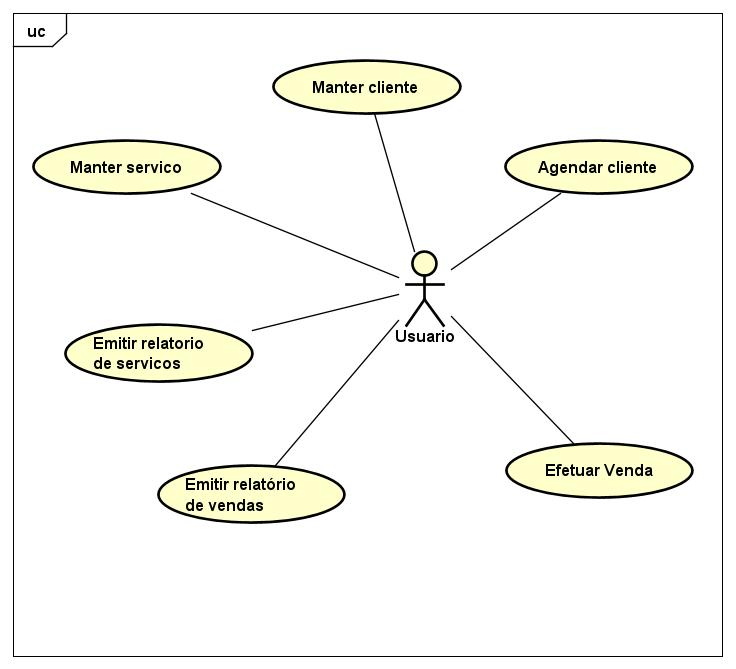
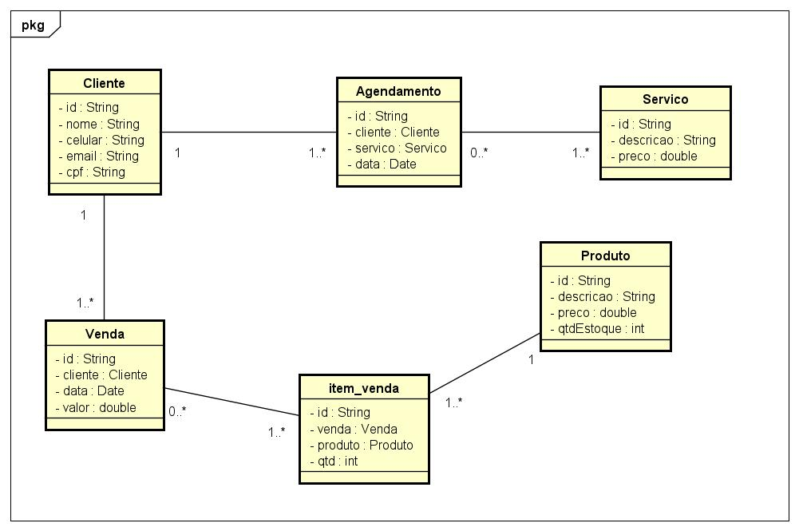

# Projeto Garagem Automotiva

## Apresentação do Sistema

https://user-images.githubusercontent.com/64432030/142081598-a59cafa6-6546-4dfb-8f03-1a183377e274.mp4

 

https://user-images.githubusercontent.com/64432030/145824493-95590119-1078-434a-aa0b-815cea294cbf.mp4

 

### Descrição do mini Mundo

 

A empresa garagem automotiva realiza serviços de estética automotiva tais como 
lavagem técnica, enceramento, limpeza de motor entre outros. A empresa precisa automatizar o
agendamento de horários dos seus clientes para realizar seus serviços e também ter controle
dos produtos vendidos para controle de seu faturamento.

 

O sistema deve ser capaz de fornecer acesso a base de dados de seus clientes para oferecer
descontos de seus serviços no ato de um serviço prestado. Também precisa ter controle de seu 
faturamento diário e ter acesso a relatórios de faturamento entre um determinado período 
de tempo. O sistema também deve ser capaz de realizar a venda de produtos e gerar o relatório
das vendas realizadas.

 

### Requisitos do Sistema 

 

 - restrição de acesso
 - manter clientes
 - manter serviços prestados 
 - agendamento de serviços
 - faturamento dos serviços
 - impressão de relatório
 - manter produtos
 - realizar venda de produtos

 

1 ) Restrição de acesso: O sistema deve restringir o acesso a usuários que não estão
cadastrados no sistema.

2 ) Manter clientes: para realizar o cadastro de cliente o usuário deverá informar as 
seguintes informações: nome, celular, e-mail, CPF;

3 ) Manter serviços prestados: para realizar o cadastro dos serviços o usuário deverá
informar as seguintes informações: descrição do serviço e preço.

4 ) Agendar serviços: para agendar um serviço o sistema deve ser capaz de agendar 
somente se o horário estiver disponível, caso contrário não poderá ser feito o agendamento
naquele horário. Para realizar o agendamento o usuário deverá informar as seguintes 
informações: nome do cliente, serviço que irá ser prestado, data e hora;

5 ) Faturamento dos serviços: o sistema deve ser capaz de realizar o faturamento dos serviços
e emitir o relatório sempre que for solicitado pelo usuário. O relatório deve conter a data e
o valor de cada serviço e o valor total naquele período.
 
6 ) Manter Produtos: para manter os produtos o usuário deverá
informar as seguintes informações: descrição do produto, preço e quantidade em estoque.
 
7 ) Realizar Venda de produtos:  o sistema deve ser capaz de realizar a venda de produtos
e emitir o relatório sempre que for solicitado pelo usuário. 

 

### Diagrama de casos de uso

 

 

### Diagrama de classes

 

 
